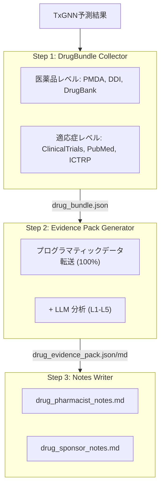
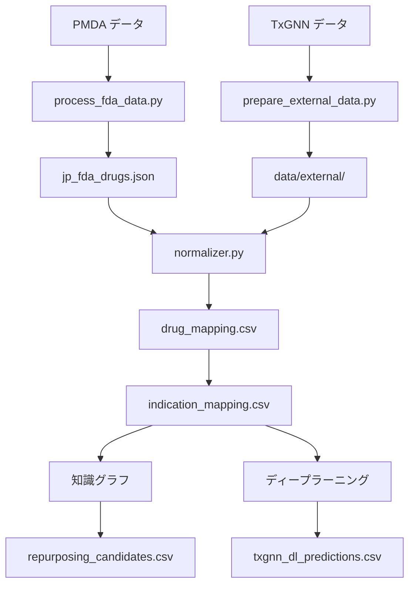

# JpTxGNN - Japan: Drug Repurposing Predictions

> 本專案由 **藥提醒科技有限公司**（[yao.care](https://www.yao.care)）開發與維運。
> JpTxGNN 站台：<https://jptxgnn.yao.care/>｜產品總覽：<https://www.yao.care/medical/txgnn/>

[](https://jptxgnn.yao.care)
[](https://opensource.org/licenses/MIT)

Japan PMDA承認医薬品のTxGNNモデルによるドラッグリポジショニング予測。

## 免責事項

- 本プロジェクトの結果は研究目的のみであり、医療アドバイスを構成するものではありません。
- ドラッグリポジショニング候補は、適用前に臨床検証が必要です。

## プロジェクト概要

### レポート統計

| 項目 | 数量 |
|------|------|
| **医薬品レポート** | 191 |
| **予測総数** | 12,395,216 |
| **ユニーク医薬品数** | 426 |
| **ユニーク適応症数** | 15,003 |
| **DDIデータ** | 302,516 |
| **DFIデータ** | 857 |
| **DHIデータ** | 35 |
| **DDSIデータ** | 8,359 |
| **FHIRリソース** | 124 MK / 1,204 CUD |

### エビデンスレベル分布

| エビデンスレベル | レポート数 | 説明 |
|---------|-------|------|
| **L1** | 13 | 複数のPhase 3 RCT |
| **L2** | 23 | 単一RCTまたは複数のPhase 2 |
| **L3** | 33 | 観察研究 |
| **L4** | 25 | 前臨床/メカニズム研究 |
| **L5** | 97 | 計算予測のみ |

### ソース別

| ソース | 予測数 |
|------|------|
| DL | 12,392,270 |
| KG + DL | 2,555 |
| KG | 391 |

### 信頼度別

| 信頼度 | 予測数 |
|------|------|
| very_high | 1,940 |
| high | 589,840 |
| medium | 1,079,027 |
| low | 10,724,409 |

---

## 予測方法

| 方法 | 速度 | 精度 | 要件 |
|------|------|--------|----------|
| 知識グラフ | 高速（秒単位） | 低い | 特別な要件なし |
| ディープラーニング | 低速（時間単位） | 高い | Conda + PyTorch + DGL |

### 知識グラフ方法

```bash
uv run python scripts/run_kg_prediction.py
```

| 指標 | 値 |
|------|------|
| PMDA 医薬品総数 | 19,148 |
| リポジショニング候補 | 2,946 |

### ディープラーニング方法

```bash
conda activate txgnn
PYTHONPATH=src python -m jptxgnn.predict.txgnn_model
```

| 指標 | 値 |
|------|------|
| DL予測総数 | 734,252 |
| ユニーク医薬品数 | 426 |
| ユニーク適応症数 | 15,003 |

### スコア解釈

TxGNNスコアは、医薬品-疾患ペアに対するモデルの信頼度を表し、0から1の範囲です。

| 閾値 | 意味 |
|-----|------|
| >= 0.9 | 非常に高い信頼度 |
| >= 0.7 | 高い信頼度 |
| >= 0.5 | 中程度の信頼度 |

#### スコア分布

| 閾値 | 意味 |
|-----|------|
| ≥ 0.9999 | 極めて高い信頼度、モデルの最も確信のある予測 |
| ≥ 0.99 | 非常に高い信頼度、検証の優先順位付けに値する |
| ≥ 0.9 | 高い信頼度 |
| ≥ 0.5 | 中程度の信頼度（シグモイド決定境界） |

#### エビデンスレベルの定義

| レベル | 定義 | 臨床的意義 |
|-----|------|---------|
| L1 | 第3相RCTまたはシステマティックレビュー | 臨床使用を支持できる |
| L2 | 第2相RCT | 使用を検討できる |
| L3 | 第1相または観察研究 | 更なる評価が必要 |
| L4 | 症例報告または前臨床研究 | まだ推奨されない |
| L5 | 計算予測のみ、臨床エビデンスなし | 更なる研究が必要 |

#### 重要な注意事項

1. **高スコアは臨床的有効性を保証しません：TxGNNスコアは知識グラフベースの予測であり、臨床試験による検証が必要です。**
2. **低スコアは無効を意味しません：モデルが特定の関連性を学習していない可能性があります。**
3. **検証パイプラインとの併用を推奨：本プロジェクトのツールを使用して、臨床試験、文献、その他のエビデンスを確認してください。**

### 検証パイプライン



---

## クイックスタート

### ステップ 1: データのダウンロード

| ファイル | ダウンロード |
|------|------|
| PMDA データ | データソース |
| node.csv | [Harvard Dataverse](https://dataverse.harvard.edu/api/access/datafile/7144482) |
| kg.csv | [Harvard Dataverse](https://dataverse.harvard.edu/api/access/datafile/7144484) |
| edges.csv | [Harvard Dataverse](https://dataverse.harvard.edu/api/access/datafile/7144483) |
| model_ckpt.zip | [Google Drive](https://drive.google.com/uc?id=1fxTFkjo2jvmz9k6vesDbCeucQjGRojLj) |

### ステップ 2: 依存関係のインストール

```bash
uv sync
```

### ステップ 3: 医薬品データの処理

```bash
uv run python scripts/process_fda_data.py
```

### ステップ 4: 語彙データの準備

```bash
uv run python scripts/prepare_external_data.py
```

### ステップ 5: 知識グラフ予測の実行

```bash
uv run python scripts/run_kg_prediction.py
```

### ステップ 6: ディープラーニング環境のセットアップ

```bash
conda create -n txgnn python=3.11 -y
conda activate txgnn
pip install torch==2.2.2 torchvision==0.17.2
pip install dgl==1.1.3
pip install git+https://github.com/mims-harvard/TxGNN.git
pip install pandas tqdm pyyaml pydantic ogb
```

### ステップ 7: ディープラーニング予測の実行

```bash
conda activate txgnn
PYTHONPATH=src python -m jptxgnn.predict.txgnn_model
```

---

## リソース

### TxGNN コア

- [TxGNN Paper](https://www.nature.com/articles/s41591-024-03233-x) - Nature Medicine, 2024
- [TxGNN GitHub](https://github.com/mims-harvard/TxGNN)
- [TxGNN Explorer](http://txgnn.org)

### データソース

| カテゴリ | データ | ソース | 備考 |
|------|------|------|------|
| **医薬品データ** | PMDA | - | Japan |
| **知識グラフ** | TxGNN KG | [Harvard Dataverse](https://dataverse.harvard.edu/dataset.xhtml?persistentId=doi:10.7910/DVN/IXA7BM) | 17,080 diseases, 7,957 drugs |
| **医薬品データベース** | DrugBank | [DrugBank](https://go.drugbank.com/) | 医薬品成分マッピング |
| **薬物相互作用** | DDInter 2.0 | [DDInter](https://ddinter2.scbdd.com/) | DDIペア |
| **薬物相互作用** | Guide to PHARMACOLOGY | [IUPHAR/BPS](https://www.guidetopharmacology.org/) | 承認薬物相互作用 |
| **臨床試験** | ClinicalTrials.gov | [CT.gov API v2](https://clinicaltrials.gov/data-api/api) | 臨床試験登録 |
| **臨床試験** | WHO ICTRP | [ICTRP API](https://apps.who.int/trialsearch/api/v1/search) | 国際臨床試験プラットフォーム |
| **文献** | PubMed | [NCBI E-utilities](https://eutils.ncbi.nlm.nih.gov/entrez/eutils/) | 医学文献検索 |
| **名称マッピング** | RxNorm | [RxNav API](https://rxnav.nlm.nih.gov/REST) | 医薬品名標準化ブリッジ |
| **名称マッピング** | PubChem | [PUG-REST API](https://pubchem.ncbi.nlm.nih.gov/docs/pug-rest) | 化学物質同義語検索 |
| **名称マッピング** | ChEMBL | [ChEMBL API](https://www.ebi.ac.uk/chembl/api/data) | 生物活性データベース |
| **標準規格** | FHIR R4 | [HL7 FHIR](http://hl7.org/fhir/) | MedicationKnowledge, ClinicalUseDefinition |
| **標準規格** | SMART on FHIR | [SMART Health IT](https://smarthealthit.org/) | EHR統合、OAuth 2.0 + PKCE |

### モデルダウンロード

| ファイル | ダウンロード | 備考 |
|------|------|------|
| 事前学習済みモデル | [Google Drive](https://drive.google.com/uc?id=1fxTFkjo2jvmz9k6vesDbCeucQjGRojLj) | model_ckpt.zip |
| node.csv | [Harvard Dataverse](https://dataverse.harvard.edu/api/access/datafile/7144482) | ノードデータ |
| kg.csv | [Harvard Dataverse](https://dataverse.harvard.edu/api/access/datafile/7144484) | 知識グラフデータ |
| edges.csv | [Harvard Dataverse](https://dataverse.harvard.edu/api/access/datafile/7144483) | エッジデータ（DL用） |

## プロジェクト紹介

### ディレクトリ構造

```
JpTxGNN/
├── README.md
├── CLAUDE.md
├── pyproject.toml
│
├── config/
│   └── fields.yaml
│
├── data/
│   ├── kg.csv
│   ├── node.csv
│   ├── edges.csv
│   ├── raw/
│   ├── external/
│   ├── processed/
│   │   ├── drug_mapping.csv
│   │   ├── repurposing_candidates.csv
│   │   ├── txgnn_dl_predictions.csv.gz
│   │   └── integration_stats.json
│   ├── bundles/
│   └── collected/
│
├── src/jptxgnn/
│   ├── data/
│   │   └── loader.py
│   ├── mapping/
│   │   ├── normalizer.py
│   │   ├── drugbank_mapper.py
│   │   └── disease_mapper.py
│   ├── predict/
│   │   ├── repurposing.py
│   │   └── txgnn_model.py
│   ├── collectors/
│   └── paths.py
│
├── scripts/
│   ├── process_fda_data.py
│   ├── prepare_external_data.py
│   ├── run_kg_prediction.py
│   └── integrate_predictions.py
│
├── docs/
│   ├── _drugs/
│   ├── fhir/
│   │   ├── MedicationKnowledge/
│   │   └── ClinicalUseDefinition/
│   └── smart/
│
├── model_ckpt/
└── tests/
```

**凡例**: 🔵 プロジェクト開発 | 🟢 ローカルデータ | 🟡 TxGNNデータ | 🟠 検証パイプライン

### データフロー



---

## 引用

このデータセットまたはソフトウェアを使用する場合は、以下を引用してください：

```bibtex
@software{jptxgnn2026,
  author       = {Yao.Care},
  title        = {JpTxGNN: Drug Repurposing Validation Reports for Japan PMDA Drugs},
  year         = 2026,
  publisher    = {GitHub},
  url          = {https://github.com/yao-care/JpTxGNN}
}
```

TxGNNの原著論文も引用してください：

```bibtex
@article{huang2023txgnn,
  title={A foundation model for clinician-centered drug repurposing},
  author={Huang, Kexin and Chandak, Payal and Wang, Qianwen and Haber, Shreyas and Zitnik, Marinka},
  journal={Nature Medicine},
  year={2023},
  doi={10.1038/s41591-023-02233-x}
}
```

